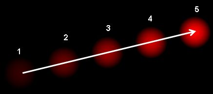

# Optical Flow animal tracking

[Optical flow](https://opencv-python-tutroals.readthedocs.io/en/latest/py_tutorials/py_video/py_lucas_kanade/py_lucas_kanade.html) to classify behavior based on movement and direction. Optical flow can be used as a feature point in behavior tracking (supervised machine learning) 

## [Optical Flow](https://en.wikipedia.org/wiki/Optical_flow)
Optical flow is the pattern of apparent motion of image objects between two consecutive frames caused by the movemement of object or camera. It is 2D vector field where each vector is a displacement vector showing the movement of points from first frame to second. Consider the image below (Image Courtesy: [Wikipedia article on Optical Flow](https://en.wikipedia.org/wiki/Optical_flow)).

